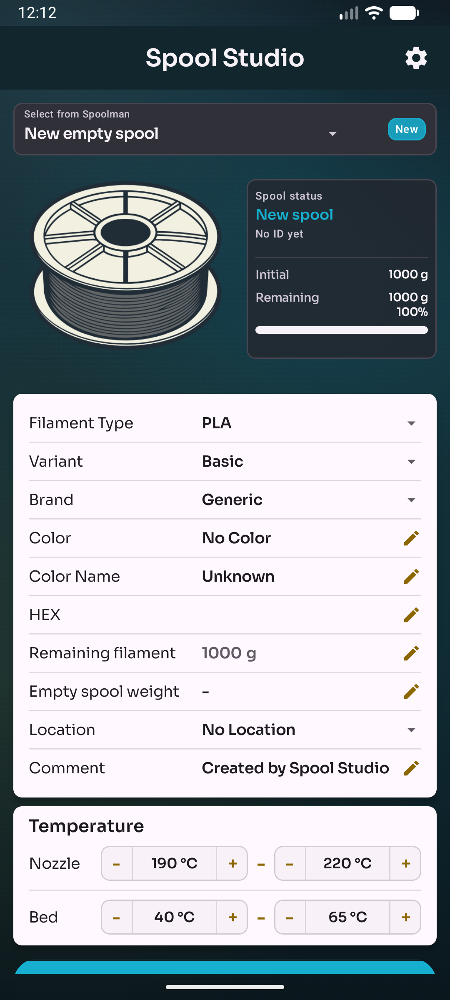
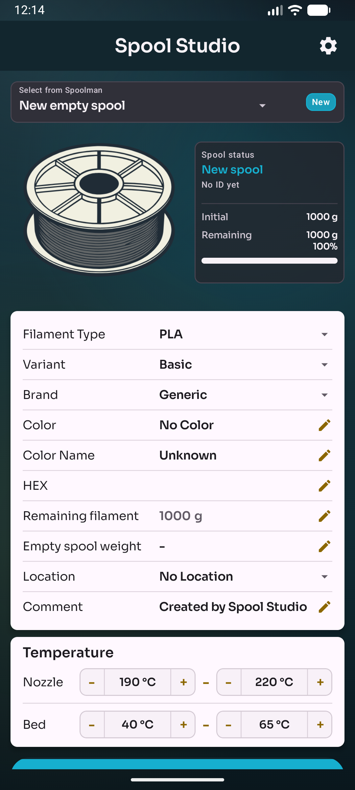
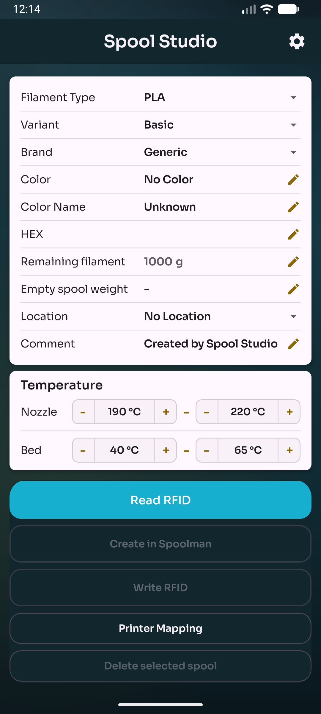

# Spool Studio

Spool Studio is an Android app for managing 3D printer filament spools with Spoolman, NFC/RFID tags, and optional printer integration.

Version 2.0 introduces a redesigned interface, improved Spoolman workflows, searchable selection dialogs, OpenSpool tag handling, printer mapping, and optional Bambu Lab RFID inspection. Version 2.0.2 adds post-release fixes for transparent filament colors, color-name editing, dynamic Spoolman-backed selection lists, and direct Bambu Lab RFID data import.

This project started from the open-source project **SpoolPainter** by ni4223 and has since been heavily extended.

---

## Download

[Download the latest APK](https://github.com/GeorgHo/SpoolStudio/releases/latest)

---

## Screenshots

  
  
  

---

## Highlights

- Modern dark UI designed for quick spool editing on a phone
- Spoolman support for reading, creating, updating, and deleting spools
- OpenSpool-compatible NFC/RFID tag read and write support
- Searchable dropdowns for spool, material, variant, brand, color, location, and spool tare weight
- Color picker, color-name recognition, and HEX color editing
- Remaining filament tracking with visual low-filament warnings
- Optional lot number and comment fields
- Optional spool tare weight field with reuse suggestions by brand
- Snapmaker U1 printer mapping through Moonraker
- Optional Bambu Lab RFID dump view when a user-provided key is configured

---

## Quick Start

### 1. Install the App

- Download the APK from the latest release.
- Install it on your Android device.
- Enable "Install unknown apps" for your browser or file manager if Android asks for it.

### 2. Connect Spoolman

- Open **Settings**.
- Enter your Spoolman URL, for example `http://10.201.0.1:8000`.
- Tap **Test Spoolman Connection**.

Once connected, the app can load spool data, create new spools, update existing entries, and synchronize data with NFC/RFID tags.

### 3. Use NFC / OpenSpool Tags

- Tap **Read RFID** to scan an existing tag.
- Tap **Write RFID** to store the current spool data on a tag.
- Spool Studio writes OpenSpool-compatible tag data.

### 4. Optional: Printer Mapping

Printer mapping is designed for:

- Snapmaker U1
- paxx12 Extended Firmware
- Moonraker
- Spoolman integration

Enter your Moonraker URL in **Settings**, test the connection, then use **Printer Mapping** to read and update active toolhead spool assignments.

### 5. Optional: Bambu Lab RFID

Bambu Lab RFID support requires a user-provided master key. The key is not included in this project.

---

## Features

### Spoolman

- Load existing spools from Spoolman
- Create a completely new spool
- Create a new spool from a selected spool
- Update spool details
- Delete a selected spool after confirmation
- Use Spoolman catalogs for materials, brands, locations, and known spool weights
- Display Spoolman server information in Settings

### Filament Data

- Material type and variant
- Brand
- Color, color name, and HEX value
- Remaining filament weight
- Optional spool tare weight
- Optional location, lot number, and comment
- Nozzle and bed temperature ranges

### NFC / RFID

- Read OpenSpool tags
- Write OpenSpool tags
- Map material names to OpenSpool-compatible values when needed
- Keep physical tags and Spoolman records aligned

### Printer Integration

- Read current toolhead spool mapping
- Assign Spoolman spools to toolheads
- Mark active spools
- Save printer mapping through Moonraker
- Show clear status and error messages instead of raw dumps

### Bambu Lab RFID

- Read and inspect Bambu Lab RFID tag data when a key is configured
- Show parsed dump data in a dedicated view
- Keep key handling user-controlled

---

## Requirements

- Android device with NFC
- Android API 21 or newer
- Spoolman server for the main workflow
- Optional: Snapmaker U1 with paxx12 Extended Firmware and Moonraker
- Optional: user-provided Bambu Lab RFID key

---

## Tech Stack

- Kotlin
- Jetpack Compose
- Material 3
- NFC API
- Coroutines
- MVVM architecture
- Spoolman API
- Moonraker API

---

## Credits

- Original project: [SpoolPainter by ni4223](https://github.com/ni4223/SpoolPainter)
- OpenSpool for the open filament tag data format
- Spoolman for filament spool management
- paxx12 for the Snapmaker U1 Extended Firmware
- Moonraker and the Klipper ecosystem

Spool Studio is extended and maintained by Hovi.

---

## License

This project is based on the original SpoolPainter project by ni4223.

Permission to publish this modified version was granted by the original author.

This project is licensed under the MIT License.

---

## Disclaimer

Spool Studio is an independent project and is not affiliated with Snapmaker, Bambu Lab, Spoolman, OpenSpool, Moonraker, Klipper, or the original SpoolPainter developer.

Bambu Lab RFID tags use proprietary encryption and access keys. This project does not provide official keys. Any key usage must be supplied and evaluated by the user.
