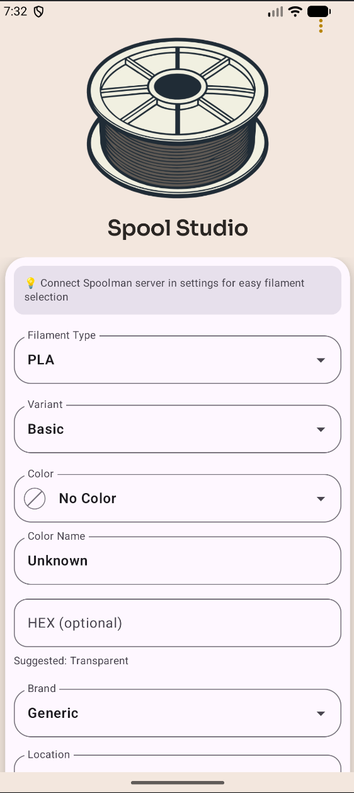
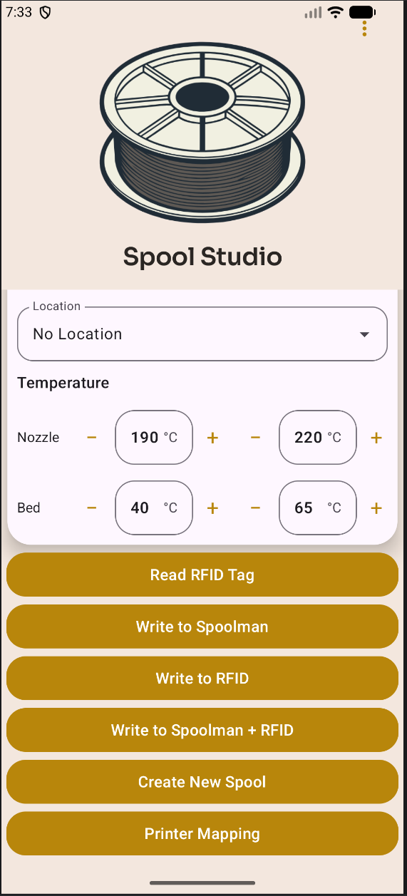
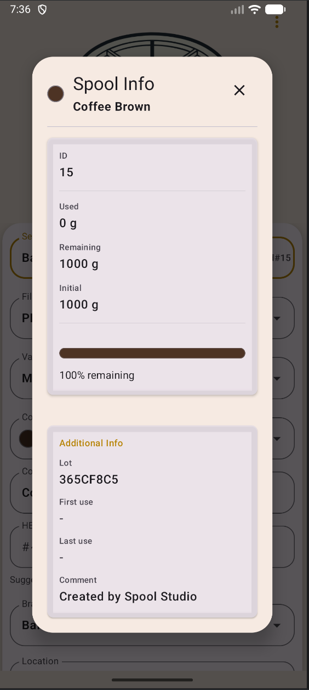
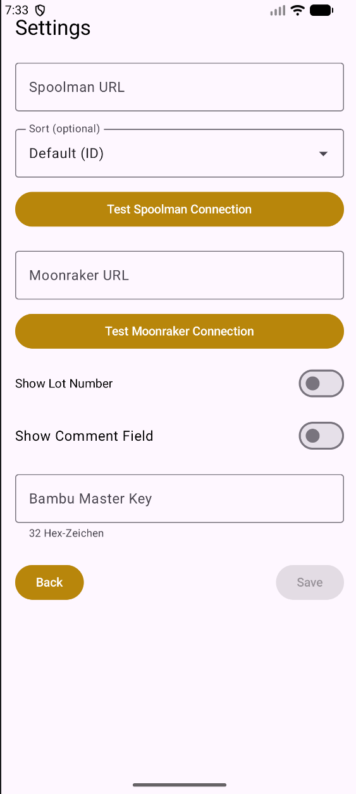
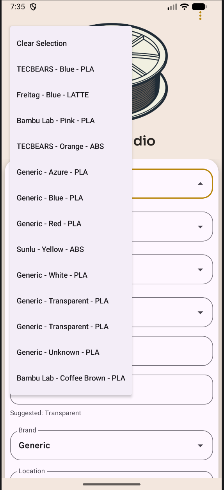
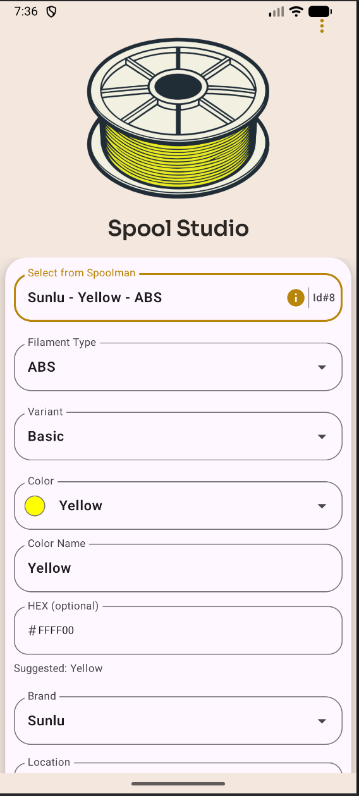
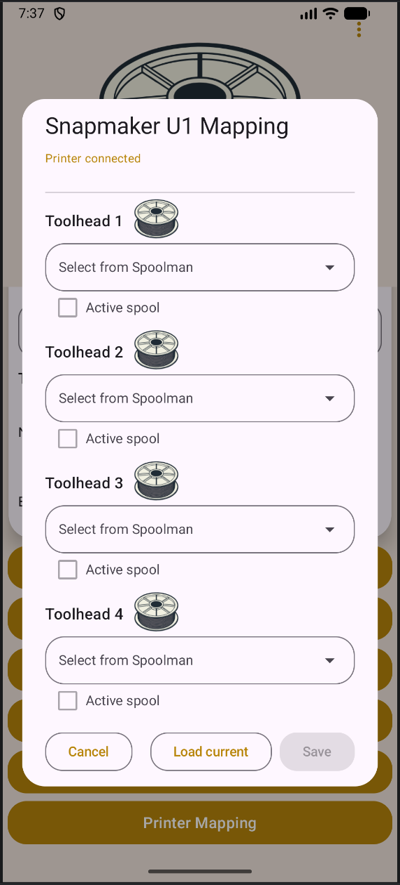
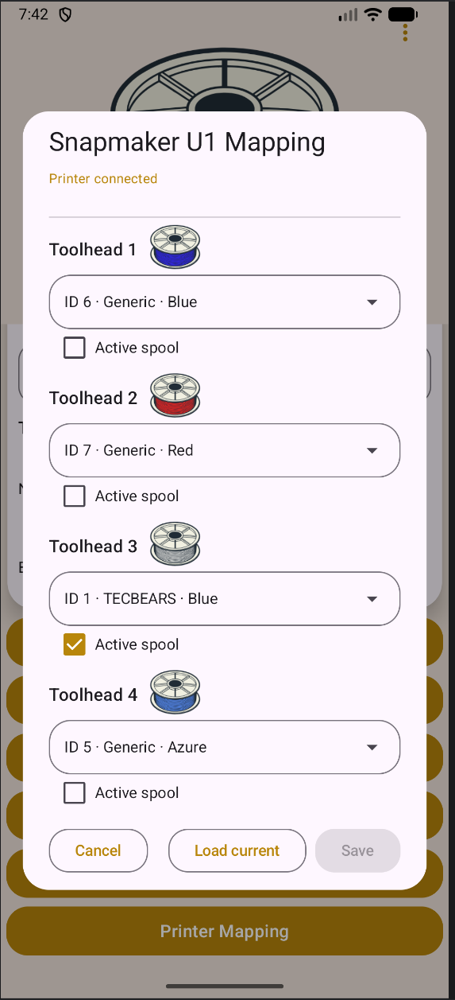

# Spool Studio

Spool Studio is an Android app for managing 3D printer filament spools using NFC, Spoolman, and direct printer integration.

This project is based on the open-source project **SpoolPainter** by ni4223 and has been significantly extended.

---

## 📥 Download

👉 [Download latest APK](https://github.com/GeorgHo/SpoolStudio/releases/latest)

---

## ✨ Features

### 🔗 Spoolman & OpenSpool Integration (Core Features)

These features work independently of printer integration and only require a Spoolman backend.
They are based on the OpenSpool data model for consistent filament data handling.

* Read spools from Spoolman

* Create new spools in Spoolman

* Edit existing spool data (material, color, temperatures, brand, location, etc.)

* Synchronize spool data between app and Spoolman

* NFC/RFID tag read and write (OpenSpool format)

* Store spool information directly on physical tags

* Maintain a consistent link between physical spools and digital records

---

### 🖨️ Printer Integration (Snapmaker U1 only)

These features require:

* Snapmaker U1

* paxx12 Extended Firmware

* Moonraker + Spoolman integration

* Read current toolhead ↔ spool assignments from the printer

* Update spool mappings (E0–E3 / Toolhead 1–4)

* Synchronize active spool usage with Spoolman

* Maintain a single source of truth between:
  App ↔ Printer ↔ Spoolman

> ⚠️ **Important:**
> Full printer integration is **only supported on the Snapmaker U1**
> and requires the **paxx12 Extended Firmware**.
> Standard Snapmaker firmware and other printers are not supported.

---

### 🏷️ Bambu Lab RFID Support (Advanced / Optional)

* Read Bambu Lab RFID tags
* Parse tag data (depending on available key)
* Extend compatibility with vendor-specific filament systems

> ⚠️ Requires a user-supplied key (not included in this project)

---

## 🔗 OpenSpool Support

Spool Studio uses the OpenSpool data format for NFC/RFID tags.

This ensures:

* standardized filament data storage
* compatibility with OpenSpool-compatible tools
* portable spool identification across systems

---

## 📸 Screenshots

### Main Screen

  
  

### Spool Details

  

### Settings (Spoolman & Moonraker)

  

### Spoolman Integration

  
  

### Printer Mapping (Snapmaker U1 / Moonraker)

  
  

---

## 🧰 Tech Stack

* Kotlin
* Jetpack Compose
* Material 3
* NFC API
* Coroutines
* MVVM architecture
* Moonraker API
* Klipper ecosystem

---

## 🙏 Credits

* Original project: https://github.com/ni4223/SpoolPainter
* Original developer: ni4223

Special thanks to:

* OpenSpool (open filament data format)
* Spoolman (filament spool management backend)
* paxx12 (Snapmaker U1 Extended Firmware)
* Moonraker Team (Klipper API layer)

This version is extended and maintained by Hovi (unofficial)

---

## ⚖️ License

This project is based on the original SpoolPainter project by ni4223.

No license was provided in the original repository.
All rights remain with the original author.

This repository contains modifications and extensions for personal and educational use.

---

## ⚠️ Disclaimer

This is an unofficial project and is not affiliated with the original developer.
This project is tested with Snapmaker U1 but is not affiliated with Snapmaker.

### Bambu Lab RFID Notice

Bambu Lab RFID tags use proprietary encryption and access keys which are **not publicly available**.

* This project does **not provide any official keys**
* Any key usage must be supplied by the user
* The developer assumes **no responsibility** for:

  * misuse
  * reverse engineering
  * potential legal implications

Use this functionality at your own risk.

---

## 📱 Requirements

* Android device with NFC
* Android API 21+
* Optional: Spoolman server (for full functionality)
* Optional: Snapmaker U1 with paxx12 firmware (for printer integration)
