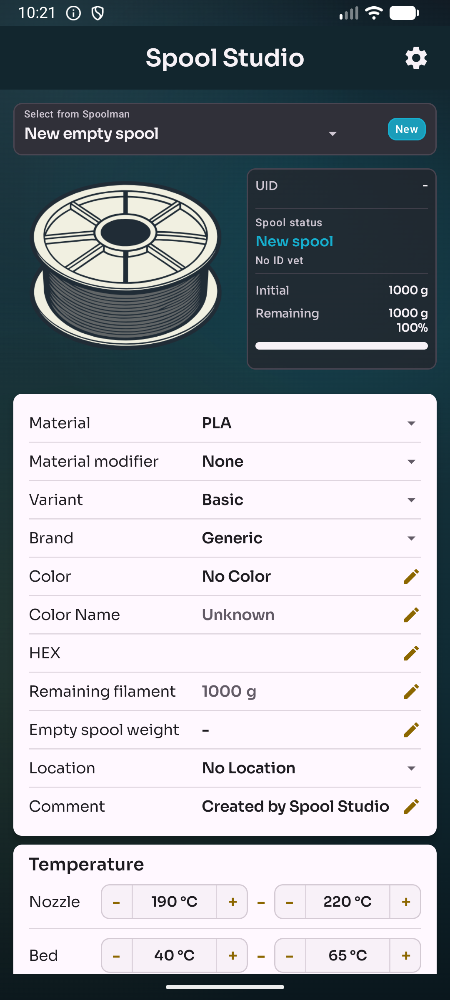
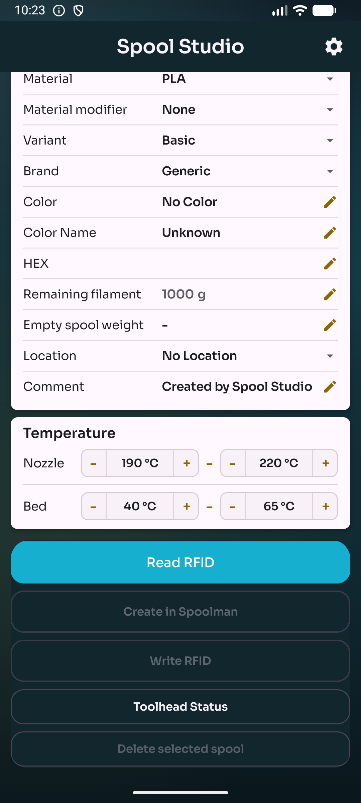
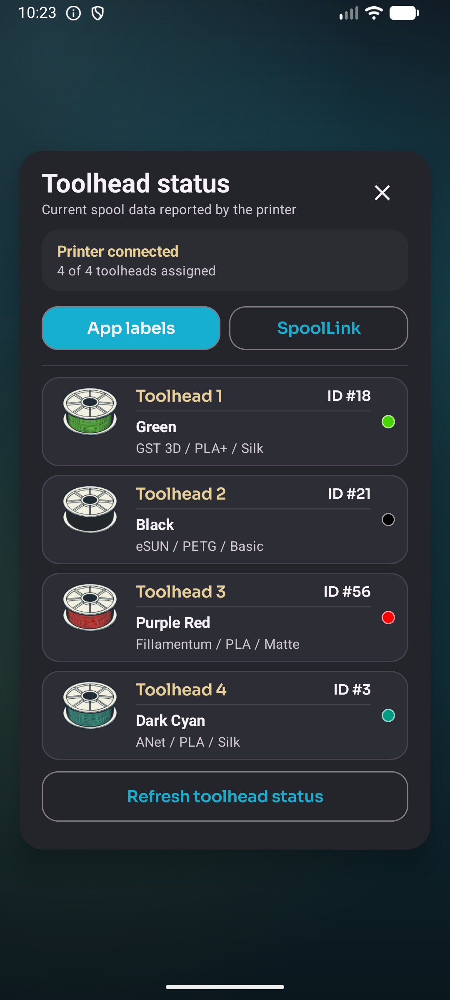

# Spool Studio

Spool Studio is an Android app for managing 3D printer filament spools with Spoolman, NFC/RFID tags, and Snapmaker U1 printer integration.

Version 3.0.0 beta introduces the new Paxx12 SpoolLink workflow. Tags are now linked to Spoolman by the physical NFC card UID instead of the old spool-id based logic. The app can convert older Spool Studio tags, prepare Spoolman for the new fields, write Paxx12-compatible OpenSpool tags, and show the toolhead status reported by the printer.

This beta was tested with **Paxx12 Extended Firmware v1.5.2-paxx12-21 beta**, based on PR #567.

This project started from the open-source project **SpoolPainter** by ni4223 and has since been heavily extended.

---

## Download

[Download Spool Studio v3.0.0 beta](https://github.com/GeorgHo/SpoolStudio/releases/tag/v3.0.0-beta)

If you still use the older Paxx12 firmware or the old Spool Studio tag workflow, use the latest stable v2 release instead:

[Download latest stable release](https://github.com/GeorgHo/SpoolStudio/releases/latest)

---

## Screenshots

  
  
  

---

## Important for v3

Spool Studio v3 is a beta release for the new Paxx12 SpoolLink workflow.

- v3 no longer writes legacy Spool Studio / spool-id based tags.
- The physical NFC tag UID is used as the primary link between tag and Spoolman spool.
- The UID is stored in Spoolman and used by Paxx12 SpoolLink.
- Old tags can be detected and converted after confirmation.
- If you decline conversion, v3 will not write legacy data.

Recommended migration workflow:

1. Install Spool Studio v3 beta.
2. Check Spoolman and printer integration in Settings.
3. Read one existing tag.
4. Convert only one spool first.
5. Verify the result in Spoolman and the Paxx12 Filament Manager.
6. Continue converting the remaining spools after a successful test.

---

## Highlights

- Paxx12 SpoolLink support for the new 1.5.x firmware workflow
- Spoolman support for reading, creating, updating, and deleting spools
- NFC/RFID read and write support for OpenSpool-compatible tags
- Legacy tag detection and guided conversion
- Physical NFC card UID storage in Spoolman
- Material, material modifier, and variant handled as separate fields
- Searchable dropdowns for spools, materials, variants, brands, colors, locations, and spool tare weights
- Bambu Lab RFID import when a user-provided key is configured
- Read-only Toolhead Status view for printer-reported spool assignments
- Modern dark UI designed for quick spool editing on a phone

---

## Quick Start

### 1. Install the App

- Download the APK from the v3 beta release.
- Install it on your Android device.
- Enable "Install unknown apps" for your browser or file manager if Android asks for it.

### 2. Connect Spoolman

- Open **Settings**.
- Enter your Spoolman URL, for example `http://10.201.0.1:8000`.
- Tap **Test Spoolman Connection**.
- Use **Show Spoolman Info** to inspect the connected Spoolman instance.

Spool Studio can check whether the required Spoolman fields are available and can guide the setup for v3-specific fields.

### 3. Connect the Snapmaker U1

- Install a compatible Paxx12 1.5.x firmware build with SpoolLink support.
- Enable the Spoolman integration in the printer firmware settings.
- Enter your Moonraker URL in **Settings**.
- Tap **Test Moonraker Connection**.

### 4. Use NFC / OpenSpool Tags

- Tap **Read RFID** to scan an existing tag.
- If an old Spool Studio tag is found, the app can offer conversion to the new UID-based workflow.
- Tap **Write RFID** to store the current spool data on a tag.

### 5. Check Toolhead Status

Use **Toolhead Status** to view the spool data reported by the printer. The dialog can show app-composed labels and SpoolLink-reported data for comparison.

### 6. Optional: Bambu Lab RFID

Bambu Lab RFID support requires a user-provided master key. The key is not included in this project.

---

## Features

### Spoolman

- Load existing spools from Spoolman
- Create a completely new spool
- Create a new spool from a selected spool
- Update spool details
- Delete a selected spool after confirmation
- Store NFC card UIDs for Paxx12 SpoolLink
- Store material modifiers through Spoolman extra fields
- Use Spoolman catalogs for materials, brands, locations, and known spool weights
- Display Spoolman server information in Settings

### Filament Data

- Material
- Material modifier, for example Plus or HS
- Variant
- Brand
- Color, color name, and HEX value
- Remaining filament weight
- Optional empty spool weight
- Optional location, product / lot code, and comment
- Nozzle and bed temperature ranges

### NFC / RFID

- Read OpenSpool tags
- Write OpenSpool tags
- Read and convert legacy Spool Studio tags
- Link physical tags and Spoolman records through the NFC card UID
- Keep tag data compatible with the Paxx12 SpoolLink workflow

### Printer Integration

- Check Moonraker reachability
- Check Paxx12 firmware integration readiness
- Show current toolhead spool status
- Compare app labels and SpoolLink-reported data
- Show clear status and error messages instead of raw dumps

### Bambu Lab RFID

- Read Bambu Lab RFID tag data when a key is configured
- Apply parsed Bambu Lab material, color, weight, and temperature data to the spool form
- Keep key handling user-controlled

---

## Requirements

- Android device with NFC
- Android API 21 or newer
- Spoolman server for the main workflow
- Paxx12 Extended Firmware 1.5.x with SpoolLink support for the v3 printer workflow
- Moonraker access to the Snapmaker U1
- Optional: user-provided Bambu Lab RFID key

---

## Tech Stack

- Kotlin
- Jetpack Compose
- Material 3
- NFC API
- Coroutines
- MVVM architecture
- Spoolman API
- Moonraker API

---

## Credits

- Original project: [SpoolPainter by ni4223](https://github.com/ni4223/SpoolPainter)
- OpenSpool for the open filament tag data format
- Spoolman for filament spool management
- paxx12 for the Snapmaker U1 Extended Firmware
- Moonraker and the Klipper ecosystem

Spool Studio is extended and maintained by Hovi.

---

## License

This project is based on the original SpoolPainter project by ni4223.

Permission to publish this modified version was granted by the original author.

This project is licensed under the MIT License.

---

## Disclaimer

Spool Studio is an independent project and is not affiliated with Snapmaker, Bambu Lab, Spoolman, OpenSpool, Moonraker, Klipper, or the original SpoolPainter developer.

Bambu Lab RFID tags use proprietary encryption and access keys. This project does not provide official keys. Any key usage must be supplied and evaluated by the user.
